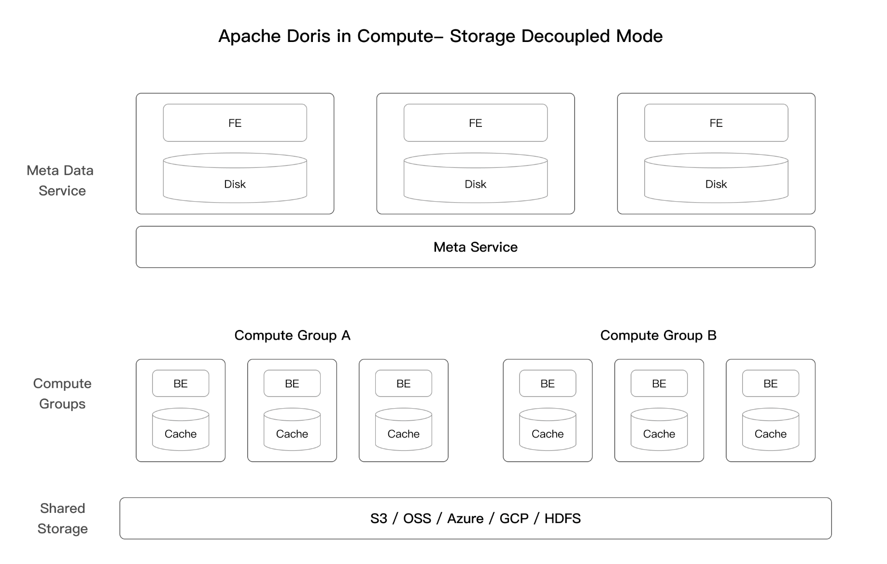

# Apache Doris on Kubernetes with Storage Compute Separation

A POC for Apache Doris 3.x on K8s demonstrating the storage compute separation capabilities

<p align="center">
  
</p>


## Installation Doris on K8s

#### Prerequisite: Spin up a S3 ( Minio ) locally

Create an S3 instance with docker :

```shell
docker run -d ^
-p 9000:9000 ^
-p 9001:9001 ^
--name minio ^
-v minio-data:/data ^
-e "MINIO_ROOT_USER=minio" ^
-e "MINIO_ROOT_PASSWORD=minio123" ^
quay.io/minio/minio server /data --address ":9000" --console-address ":9001"
```

Note: Replace `^` with `\` for Linux

Once the container is up, login to the UI, and create a bucket called `doris`

- UI - http://localhost:9001/browse
- user/pass - minio/minio123

### Install core components

1. [Install FoundationDB](docs/Install FoundationDB on K8s.md)
2. [Install Doris Cluster](docs/Install Doris Cluster on K8s.md)

### Demo


## References

https://doris.apache.org/docs/dev/compute-storage-decoupled/overview
