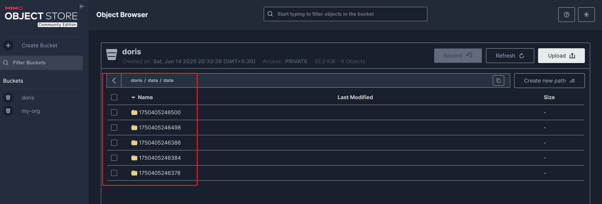
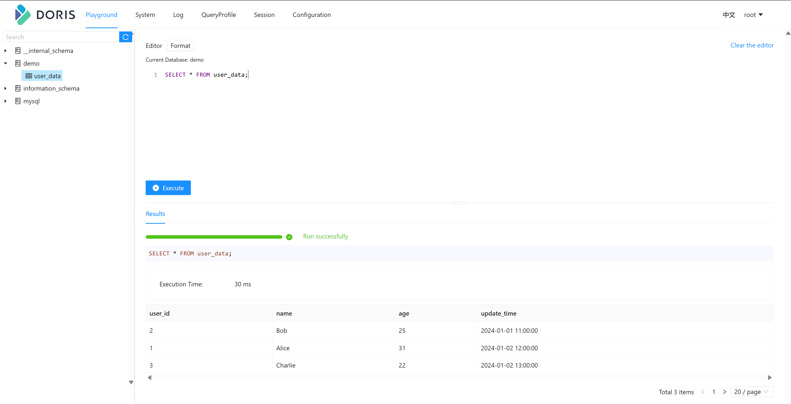

# Apache Doris on Kubernetes with Storage Compute Separation

A POC for Apache Doris 3.x on K8s demonstrating the storage compute separation capabilities

<p align="center">
  
</p>

## Installation Doris on K8s

#### Prerequisite: Spin up a S3 ( Minio ) locally

Create an S3 instance with docker :

```shell
docker run -d ^
-p 9000:9000 ^
-p 9001:9001 ^
--name minio ^
-v minio-data:/data ^
-e "MINIO_ROOT_USER=minio" ^
-e "MINIO_ROOT_PASSWORD=minio123" ^
quay.io/minio/minio server /data --address ":9000" --console-address ":9001"
```

Note: Replace `^` with `\` for Linux

Once the container is up, login to the UI, and create a bucket called `doris`

- UI - http://localhost:9001/browse
- user/pass - minio/minio123

### Install core components

1. [Install FoundationDB](docs/Install_FoundationDB_on_K8s.md)
2. [Install Doris Cluster](docs/Install_Doris_Cluster_on_K8s.md)

### Demo

Login to the MySQL Shell by logging into the FE node

```shell
kubectl -n doris exec -it doris-disaggregated-cluster-fe-0 -- /bin/bash
```

Within the Pod, connect to the Doris cluster directly using the Service name:、

```shell
mysql -uroot -P9030 -h doris-disaggregated-cluster-fe
```

Then, execute the following statements :

```sql
create database demo;

use demo; 

CREATE TABLE IF NOT EXISTS demo.user_data (
    user_id INT,
    name STRING,
    age INT,
    update_time DATETIME
)
UNIQUE KEY(user_id)
DISTRIBUTED BY HASH(user_id) BUCKETS 3
PROPERTIES (
    "replication_num" = "1",
    "enable_unique_key_merge_on_write" = "true"
);

insert into demo.user_data values
(1, "Alice", 30, "2024-01-01 10:00:00"),
(2, "Bob", 25, "2024-01-01 11:00:00");

select * from demo.user_data;

-- Upsert data
insert into demo.user_data values
(1, "Alice", 31, "2024-01-02 12:00:00"),
(3, "Charlie", 22, "2024-01-02 13:00:00");
```

After this, you should be able to see this data on S3:

<p align="center">
  
</p>

You can also see the data now on the Doris UI based SQL Editor:

```shell
kubectl get svc -n doris

kubectl port-forward svc/doris-disaggregated-cluster-fe 8030:8030 -n doris
```

- UI: http://localhost:8030/login
- user/pass - root/NA

<p align="center">
  
</p>


## References

https://doris.apache.org/docs/dev/compute-storage-decoupled/overview
